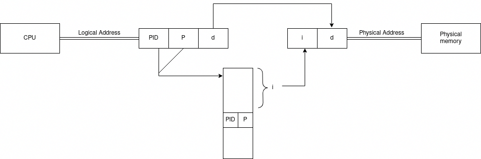
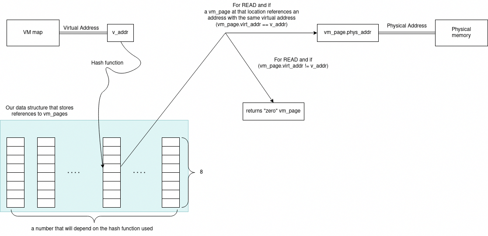

# Internship Final Report

11/07/2022

Ahmadsho Akdodshoev

_[Link to github repository](https://github.com/simply-pleb/PhantomOS-vm_map)_ (https://github.com/simply-pleb/PhantomOS-vm_map)

## The issue with multilevel paging in the current Phantom OS port

The full report can be read in the group chat under the same title.

Hypothetically multilevel paging was shown to be inefficient for the goal because for taking the snapshot the vm map has to:
- find pages that are both loaded in memory and are dirty, and 
- then take their snapshot. 

This could be done either by:
- iterating over the whole virtual table which is extremely inefficient, or
- somehow maintaining a list of pages that are simultaneously in memory and are dirty. 

The latter partially reminds of an ___inverted page table___ structure.

## The current inverted page table structure and related issues

Let's have a look at the current data structure with a contrast to a textbook example of an inverted page table.





This is an illustration of read (get_page) function.

Notice that currently the data structure only stores references to vm_pages and allocates memory for new vm_pages. Potential problems with it will be described later, but first let us look at what this structure attempts to solve.

All our programs run on a single process and are essentially threads of the main process on which even the kernel is run. We need a mechanism to map virtual addresses inside programs(threads) to the physical memory addresses.

### What happens on read

Given a virtual address ```v_addr```, it gets hashed through a special hash function. Afterwards, a vm_page with virt_addr equal to the v_addr is searched in all 8 reserved locations. If a vm_page with the given v_addr is not found, then it either did not exist or got lost. The latter problem might occur more often than desirable, but why?

### What happens on write

On a write operation ```vm_map_page_init(void*)```, which allocates space of a new vm_page, is called with a consequent call to ```set_page(vm_page*)```. It first tries to find a page with a similar virtual address. If such a page exists, a mutex lock is performed. In other case the position of the vm_page is determined in the hash-table and the reference to the page is put in there.

### Loss of reference problem

A loss of reference to a vm_page occurs exactly due to careless write operations. The data structure creates the vm_pages and only it is responsible for storing references to them. A reference is lost because the structure can hold only 8 references and when a write is called, a page can be displaced beforetime.

### Memory leakage problem

This problem occurs as a consequence of the previous problem. If a vm_page is created, then it needs to be destroyed, but it cannot be destroyed if the reference is lost.

### The structure should not lose a single reference 

The loss of references is evident without testing. The objective of the data structure was to provide a reliable mapping between virtual and physical addresses, but currently it is not the case because references are lost and as a bonus memory is leaked.

### Potential solutions

The solution with minimal changes to the current design:
- An optimal hash function, and 
- a hash table without "fixed size"

### Personal questions

- There is a function in the interface for create a vm_page, but why is there no function for deleting a vm_page?
- When should a pageout function be called? What does the pageout function do? 

### Measurements of the data structure 

___Space analysis___

Supposing that the hash function some natural number $N$ that determines the number of entries. It is known that each entry has 8 values each storing a pointer to a ```vm_page```. The number $N$ should be chosen such that it minimizes the miss ratio. _Hypothetically, losing a reference to a page inside the data structure leads to the permanent loss of the reference for the whole duration of the program._ Therefore, the space complexity is asymptotically $O(N)$.

Let us calculate the number of bytes used with some arbitrary $N=99991$, which is the greatest prime number $<10^5$.

$$S = 8 \cdot N \cdot a,$$

where $a$ is the size of a pointer to ```vm_page```, in our case $a = 8 \text{ bytes}$.

$$S = 6,399,424 \text{ bytes}$$
$$S = 6.1 \text{ MB}$$

Unfortunately the arbitrarily chosen $N$ does not guaranty that problems with losing references will not occur. Let us choose some other $N$ closer to the size of a $4 \text{ GB}$ RAM. Such RAM will use $2^{22}$ pages with $2^{10} \text{ byte} = 4 \text{ KB}$ sized page. Now, let us calculate $S$ with $N \approx 4000000$.

$$S = 256000000 \text{ bytes}$$
$$S = 244 \text{ MB}$$

Thus, in our case an adequately sized page table with supposedly minimal miss ratio will occupy at least $244 \text{ MB}$ of memory. Notice that a page table of this size can be consider extremely large.

___Time analysis___

The time complexity of the search of a ```vm_page``` will depend on the hash function. _Hypothetically, such a call will have asymptotical time complexity of O(1) or O(log N)._
